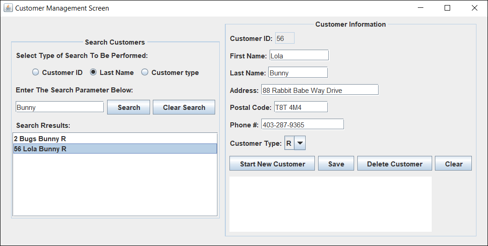

# inventory-mgmt-system
Java desktop application that allows clients to browse and update records

### Description:

* Client-server architecture
* SQL database
* Supports multiple clients (implements a thread pool)
* MVC design pattern
* Object serialization for communication between the server and clients
* Created as part of a lab exercise for ENSF 607 course

### Screenshot:

